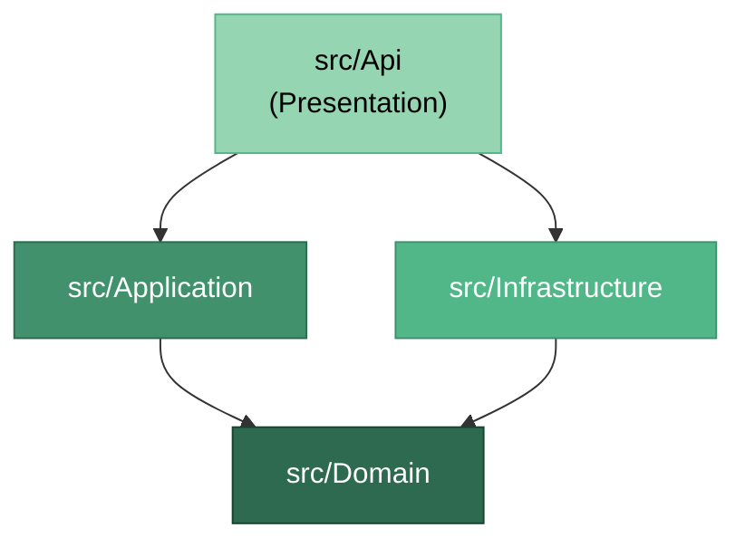
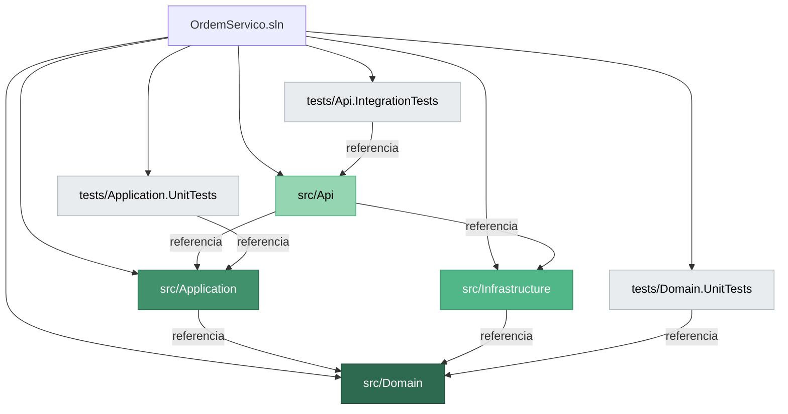
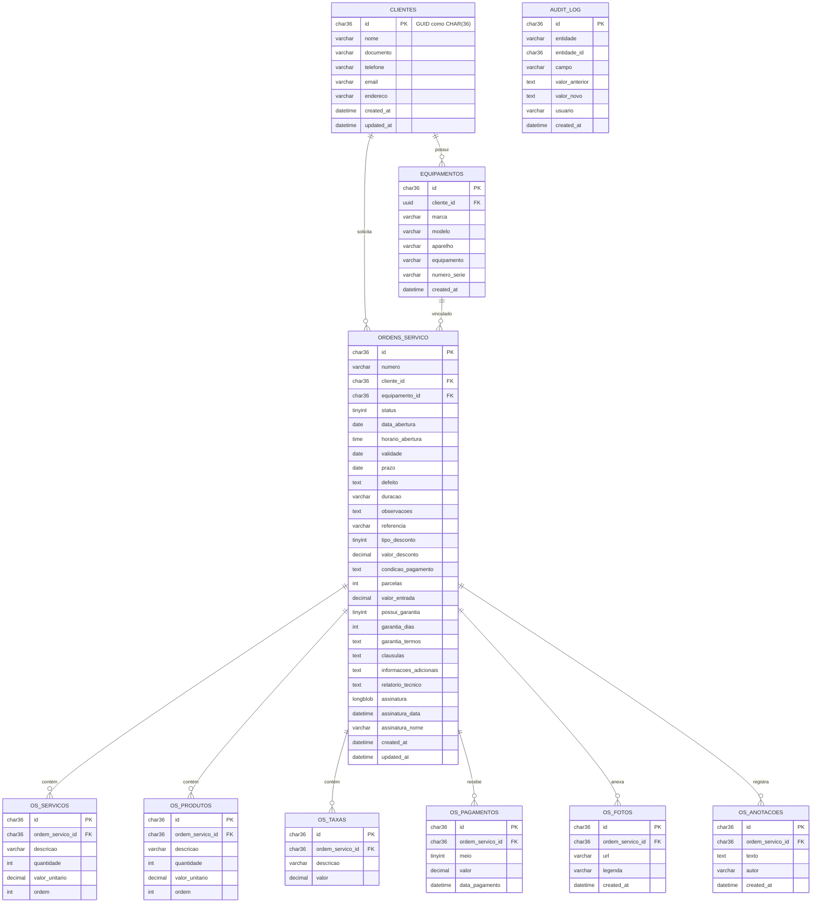

# 🏗️ Arquitetura da API — Sistema de Ordem de Serviço

> [!NOTE]
> Documento de referência arquitetural. **Nenhum código deve ser escrito antes de validar este documento.**

---

## 1. Visão Geral

A API segue o padrão **Clean Architecture**, organizando o código em 4 camadas concêntricas com dependências apontando **sempre para dentro** (em direção ao domínio).

```
┌──────────────────────────────────────────────────┐
│                  PRESENTATION                     │
│          (src/Api — Minimal APIs)                 │
│  ┌────────────────────────────────────────────┐  │
│  │              APPLICATION                    │  │
│  │    (src/Application — Services, DTOs)       │  │
│  │  ┌──────────────────────────────────────┐  │  │
│  │  │             DOMAIN                    │  │  │
│  │  │  (src/Domain — Entities, Interfaces)  │  │  │
│  │  └──────────────────────────────────────┘  │  │
│  └────────────────────────────────────────────┘  │
│  ┌────────────────────────────────────────────┐  │
│  │           INFRASTRUCTURE                    │  │
│  │  (src/Infrastructure — EF Core, Redis)       │  │
│  └────────────────────────────────────────────┘  │
└──────────────────────────────────────────────────┘
```

### Regra de Dependência



> [!IMPORTANT]
> **Domain não referencia nenhuma outra camada.** Application e Infrastructure referenciam Domain. Api referencia Application e Infrastructure (para registro de DI).

---

## 2. Stack Tecnológico

| Componente | Tecnologia | Justificativa |
|---|---|---|
| **Runtime** | .NET 10 / C# | Versão mais recente, performance otimizada |
| **API Framework** | ASP.NET Core Minimal APIs | Menor overhead, sem controllers, endpoints explícitos |
| **ORM** | Entity Framework Core | Produtividade, migrations automáticas, LINQ type-safe |
| **Banco de Dados** | MySQL (Pomelo.EntityFrameworkCore.MySql) | Amplamente adotado, excelente tooling, custo acessível |
| **Cache** | Redis (StackExchange.Redis) | Cache distribuído, proteção contra stampede |
| **Logging/Métricas** | Application Insights + Serilog | Logging estruturado, tracing distribuído |
| **Validação** | FluentValidation | Validações ricas e testáveis, separadas dos DTOs |
| **Serialização** | System.Text.Json | Nativo do .NET, zero alocação extra |
| **Testes** | xUnit + NSubstitute + Bogus | Stack padrão .NET para testes |
| **Hosting** | Azure App Service | PaaS, auto-scaling, deployment slots |

> [!WARNING]
> **NÃO usamos**: MediatR, AutoMapper, Controllers MVC. Preferimos padrões simples e explícitos.

---

## 3. Camadas em Detalhe

### 3.1 Domain (`src/Domain/`)

O **coração** do sistema. Contém entidades, value objects, interfaces de repositório e regras de negócio puras. **Zero dependências externas** — apenas tipos do .NET base.

**Responsabilidades:**
- Entidades de domínio com regras de negócio embutidas
- Value Objects para tipos ricos (ex: `Dinheiro`, `NumeroOS`)
- Interfaces de repositório (contratos, não implementações)
- Interfaces de serviços externos (contratos)
- Enums de domínio (status, tipos)
- Exceções de domínio tipadas

```
src/Domain/
├── Domain.csproj
│
├── Entities/
│   ├── OrdemServico.cs              # Entidade raiz (aggregate root)
│   ├── OrdemServicoServico.cs       # Item de serviço da OS
│   ├── OrdemServicoProduto.cs       # Item de produto da OS
│   ├── OrdemServicoTaxa.cs          # Taxa aplicada
│   ├── OrdemServicoPagamento.cs     # Pagamento registrado
│   ├── OrdemServicoFoto.cs          # Foto anexada
│   ├── OrdemServicoAnotacao.cs      # Anotação interna
│   ├── Cliente.cs                   # Entidade de cliente
│   └── Equipamento.cs              # Entidade de equipamento
│
├── ValueObjects/
│   ├── NumeroOS.cs                  # Número formatado da OS (OS-YYYYMMDD-XXXX)
│   ├── Dinheiro.cs                  # Valor monetário com precisão decimal
│   └── Desconto.cs                  # Desconto (percentual ou valor fixo)
│
├── Enums/
│   ├── StatusOS.cs                  # Rascunho, Orçamento, Aprovada, etc.
│   ├── TipoDesconto.cs             # Percentual, ValorFixo
│   └── MeioPagamento.cs            # Dinheiro, PIX, CartaoCredito, etc.
│
├── Interfaces/
│   ├── Repositories/
│   │   ├── IOrdemServicoRepository.cs
│   │   ├── IClienteRepository.cs
│   │   └── IEquipamentoRepository.cs
│   ├── IUnitOfWork.cs               # Controle transacional
│   └── ICacheService.cs             # Abstração de cache
│
└── Exceptions/
    ├── DomainException.cs           # Base para exceções de domínio
    ├── StatusTransicaoInvalidaException.cs
    └── DescontoExcedeTotalException.cs
```

> [!TIP]
> Entidades no Domain **não** são anêmicas. Elas encapsulam regras de negócio. Exemplo: `OrdemServico.AprovarOrcamento()` valida se a transição de status é permitida antes de mudar o estado.

---

### 3.2 Application (`src/Application/`)

Orquestra os casos de uso. Coordena entidades de domínio, repositórios e serviços externos. **Não contém regras de negócio** — apenas fluxo de aplicação.

**Responsabilidades:**
- Application Services (casos de uso)
- DTOs de request/response
- Validações de input (FluentValidation)
- Mapeamento entre DTOs ↔ Entidades (manual, sem AutoMapper)
- Interfaces de serviços de aplicação

```
src/Application/
├── Application.csproj
│
├── Services/
│   ├── IOrdemServicoService.cs      # Interface do serviço
│   ├── OrdemServicoService.cs       # Implementação dos casos de uso
│   ├── IClienteService.cs
│   ├── ClienteService.cs
│   ├── IEquipamentoService.cs
│   └── EquipamentoService.cs
│
├── DTOs/
│   ├── OrdemServico/
│   │   ├── CriarOrdemServicoRequest.cs
│   │   ├── AtualizarOrdemServicoRequest.cs
│   │   ├── OrdemServicoResponse.cs
│   │   ├── OrdemServicoResumoResponse.cs   # Para listagens
│   │   ├── AdicionarServicoRequest.cs
│   │   ├── AdicionarProdutoRequest.cs
│   │   ├── AplicarDescontoRequest.cs
│   │   ├── AdicionarTaxaRequest.cs
│   │   ├── RegistrarPagamentoRequest.cs
│   │   ├── AdicionarAnotacaoRequest.cs
│   │   └── AlterarStatusRequest.cs
│   ├── Cliente/
│   │   ├── CriarClienteRequest.cs
│   │   └── ClienteResponse.cs
│   └── Common/
│       ├── PagedRequest.cs              # Paginação genérica
│       └── PagedResponse.cs
│
├── Validators/
│   ├── CriarOrdemServicoValidator.cs
│   ├── AtualizarOrdemServicoValidator.cs
│   ├── AdicionarServicoValidator.cs
│   ├── AdicionarProdutoValidator.cs
│   ├── AplicarDescontoValidator.cs
│   └── CriarClienteValidator.cs
│
├── Mappings/
│   └── OrdemServicoMappings.cs      # Extension methods: ToResponse(), ToDomain()
│
└── DependencyInjection.cs           # Registro de services da camada Application
```

> [!NOTE]
> **Sem MediatR/CQRS.** Usamos Application Services diretamente. É mais simples, mais fácil de debugar e suficiente para o escopo deste sistema. Se a complexidade crescer, CQRS pode ser adicionado depois.

---

### 3.3 Infrastructure (`src/Infrastructure/`)

Implementa as interfaces definidas em Domain. Contém todo o acesso a recursos externos: banco de dados, cache, file storage, clientes HTTP.

**Responsabilidades:**
- DbContext do EF Core e configurações Fluent API
- Implementação dos repositórios sobre o DbContext
- Migrations gerenciadas pelo EF Core
- Acesso ao Redis para cache
- Upload/storage de arquivos (fotos)
- Configuração de conexões

```
src/Infrastructure/
├── Infrastructure.csproj
│
├── Data/
│   ├── AppDbContext.cs               # DbContext principal (DbSets, OnModelCreating)
│   ├── UnitOfWork.cs                 # Implementação de IUnitOfWork (wraps SaveChangesAsync)
│   └── Configurations/
│       ├── OrdemServicoConfiguration.cs       # Fluent API para OrdemServico
│       ├── OrdemServicoServicoConfiguration.cs
│       ├── OrdemServicoProdutoConfiguration.cs
│       ├── OrdemServicoTaxaConfiguration.cs
│       ├── OrdemServicoPagamentoConfiguration.cs
│       ├── OrdemServicoFotoConfiguration.cs
│       ├── OrdemServicoAnotacaoConfiguration.cs
│       ├── ClienteConfiguration.cs
│       └── EquipamentoConfiguration.cs
│
├── Repositories/
│   ├── OrdemServicoRepository.cs     # Implementação com EF Core (DbContext)
│   ├── ClienteRepository.cs
│   └── EquipamentoRepository.cs
│
├── Migrations/                       # Geradas automaticamente pelo EF Core
│   └── (geradas via dotnet ef migrations add)
│
├── Cache/
│   ├── RedisCacheService.cs          # Implementação de ICacheService
│   └── CacheKeys.cs                  # Constantes de chaves de cache
│
├── Storage/
│   └── AzureBlobStorageService.cs    # Upload de fotos para Azure Blob Storage
│
└── DependencyInjection.cs            # Registro de DbContext, repositórios e serviços
```

> [!TIP]
> **Fluent API em classes separadas** (`IEntityTypeConfiguration<T>`) mantém o `AppDbContext` limpo. Cada entidade tem sua própria configuração de mapeamento.

> [!NOTE]
> **Migrations via EF Core CLI:**
> ```bash
> # Criar migration
> dotnet ef migrations add NomeDaMigration --project src/Infrastructure --startup-project src/Api
> # Aplicar migrations
> dotnet ef database update --project src/Infrastructure --startup-project src/Api
> ```

---

### 3.4 Api (`src/Api/`)

Camada de apresentação. Recebe requests HTTP, delega para Application Services e retorna responses. Usa **Minimal APIs** — sem controllers.

**Responsabilidades:**
- Endpoints HTTP organizados por feature
- Middleware (error handling, logging, auth)
- Configuração de DI (composição raiz)
- Configuração de pipeline (CORS, rate limiting, etc.)
- Swagger/OpenAPI

```
src/Api/
├── Api.csproj
│
├── Program.cs                       # Composição raiz: DI + pipeline
├── appsettings.json
├── appsettings.Development.json
│
├── Endpoints/
│   ├── OrdemServicoEndpoints.cs     # Mapeia rotas de OS
│   ├── ClienteEndpoints.cs          # Mapeia rotas de cliente
│   └── EquipamentoEndpoints.cs      # Mapeia rotas de equipamento
│
├── Middleware/
│   ├── GlobalExceptionHandler.cs    # Converte exceções em ProblemDetails
│   ├── RequestLoggingMiddleware.cs  # Log de request/response
│   └── CorrelationIdMiddleware.cs   # Tracing com ID de correlação
│
├── Filters/
│   └── ValidationFilter.cs         # Executa FluentValidation antes do handler
│
└── Extensions/
    ├── ServiceCollectionExtensions.cs  # Métodos de extensão para DI
    └── WebApplicationExtensions.cs     # Métodos de extensão para pipeline
```

---

### 3.5 Tests (`tests/`)

```
tests/
├── Domain.UnitTests/
│   ├── Domain.UnitTests.csproj
│   ├── Entities/
│   │   ├── OrdemServicoTests.cs         # Regras de negócio da entidade
│   │   └── OrdemServicoCalculoTests.cs  # Cálculos de total, desconto
│   └── ValueObjects/
│       ├── NumeroOSTests.cs
│       ├── DinheiroTests.cs
│       └── DescontoTests.cs
│
├── Application.UnitTests/
│   ├── Application.UnitTests.csproj
│   ├── Services/
│   │   └── OrdemServicoServiceTests.cs
│   └── Validators/
│       └── CriarOrdemServicoValidatorTests.cs
│
└── Api.IntegrationTests/
    ├── Api.IntegrationTests.csproj
    ├── Fixtures/
    │   └── WebApplicationFixture.cs     # Setup do TestServer
    ├── Endpoints/
    │   ├── OrdemServicoEndpointsTests.cs
    │   └── ClienteEndpointsTests.cs
    └── TestData/
        └── OrdemServicoTestData.cs      # Builders/Fakers com Bogus
```

---

## 4. Estrutura Completa do Projeto

```
📁 07-03-2026/
├── 📁 doc/
│   ├── ordem_servico_regras_negocio.md
│   └── arquitetura_api.md                  ← este documento
│
├── 📁 src/
│   ├── 📁 Api/
│   │   ├── Api.csproj
│   │   ├── Program.cs
│   │   ├── appsettings.json
│   │   ├── appsettings.Development.json
│   │   ├── 📁 Endpoints/
│   │   ├── 📁 Middleware/
│   │   ├── 📁 Filters/
│   │   └── 📁 Extensions/
│   │
│   ├── 📁 Application/
│   │   ├── Application.csproj
│   │   ├── DependencyInjection.cs
│   │   ├── 📁 Services/
│   │   ├── 📁 DTOs/
│   │   ├── 📁 Validators/
│   │   └── 📁 Mappings/
│   │
│   ├── 📁 Domain/
│   │   ├── Domain.csproj
│   │   ├── 📁 Entities/
│   │   ├── 📁 ValueObjects/
│   │   ├── 📁 Enums/
│   │   ├── 📁 Interfaces/
│   │   └── 📁 Exceptions/
│   │
│   └── 📁 Infrastructure/
│       ├── Infrastructure.csproj
│       ├── DependencyInjection.cs
│       ├── 📁 Repositories/
│       ├── 📁 Data/
│       ├── 📁 Cache/
│       └── 📁 Storage/
│
├── 📁 tests/
│   ├── 📁 Domain.UnitTests/
│   ├── 📁 Application.UnitTests/
│   └── 📁 Api.IntegrationTests/
│
├── OrdemServico.sln                        # Solution file
├── .editorconfig
├── Directory.Build.props                   # Propriedades comuns (versão, nullable, etc.)
└── Directory.Packages.props                # Central Package Management
```

---

## 5. Referências entre Projetos



> [!CAUTION]
> **Violações proibidas:**
> - `Domain` **NUNCA** referencia `Application`, `Infrastructure` ou `Api`
> - `Application` **NUNCA** referencia `Infrastructure` ou `Api`
> - `Infrastructure` **NUNCA** referencia `Application` ou `Api`

---

## 6. Padrões e Convenções

### 6.1 Endpoints (Minimal APIs)

Cada arquivo de endpoints agrupa rotas de uma feature:

```csharp
// Exemplo conceitual — NÃO implementar ainda
public static class OrdemServicoEndpoints
{
    public static void MapOrdemServicoEndpoints(this WebApplication app)
    {
        var group = app.MapGroup("/api/v1/ordens-servico")
            .WithTags("Ordens de Serviço");

        group.MapPost("/", CriarOrdemServico);
        group.MapGet("/{id:guid}", ObterPorId);
        group.MapGet("/", Listar);
        group.MapPut("/{id:guid}", Atualizar);
        group.MapPatch("/{id:guid}/status", AlterarStatus);
        // ... demais endpoints
    }
}
```

### 6.2 Application Services

Padrão simples: interface + implementação. Sem mediator/handlers.

```csharp
// Exemplo conceitual — NÃO implementar ainda
public sealed class OrdemServicoService : IOrdemServicoService
{
    private readonly IOrdemServicoRepository _repository;
    private readonly IUnitOfWork _unitOfWork;
    private readonly ICacheService _cache;

    public async Task<OrdemServicoResponse> CriarAsync(
        CriarOrdemServicoRequest request,
        CancellationToken cancellationToken)
    {
        // 1. Mapear DTO → Entidade
        // 2. Executar regras de domínio
        // 3. Persistir via repositório
        // 4. Invalidar cache
        // 5. Retornar response
    }
}
```

### 6.3 Repositórios (EF Core)

Repositórios encapsulam queries LINQ sobre o `AppDbContext`:

```csharp
// Exemplo conceitual — NÃO implementar ainda
public sealed class OrdemServicoRepository : IOrdemServicoRepository
{
    private readonly AppDbContext _context;

    public OrdemServicoRepository(AppDbContext context)
    {
        _context = context;
    }

    public async Task<OrdemServico?> GetByIdAsync(
        Guid id,
        CancellationToken cancellationToken)
    {
        return await _context.OrdensServico
            .Include(os => os.Servicos)
            .Include(os => os.Produtos)
            .Include(os => os.Taxas)
            .FirstOrDefaultAsync(os => os.Id == id, cancellationToken);
    }

    public async Task AddAsync(
        OrdemServico ordemServico,
        CancellationToken cancellationToken)
    {
        await _context.OrdensServico.AddAsync(ordemServico, cancellationToken);
    }
}
```

> [!WARNING]
> **Cuidado com N+1 queries.** Sempre usar `.Include()` explícito ou `.AsSplitQuery()` para coleções. Nunca confiar em lazy loading — ele está **desabilitado** intencionalmente.

### 6.4 Entity de Domínio (Rich Model)

Entidades encapsulam regras de negócio:

```csharp
// Exemplo conceitual — NÃO implementar ainda
public sealed class OrdemServico
{
    public Guid Id { get; private set; }
    public NumeroOS Numero { get; private set; }
    public StatusOS Status { get; private set; }

    // Status só muda via métodos que validam transição
    public void AprovarOrcamento()
    {
        if (Status != StatusOS.Orcamento)
            throw new StatusTransicaoInvalidaException(Status, StatusOS.Aprovada);

        Status = StatusOS.Aprovada;
    }

    // Cálculo de total é responsabilidade da entidade
    public Dinheiro CalcularTotal() { /* ... */ }
}
```

---

## 7. Cross-Cutting Concerns

### 7.1 Error Handling

| Tipo de Erro | HTTP Status | Tratamento |
|---|---|---|
| Validação (FluentValidation) | `400 Bad Request` | Retorna `ProblemDetails` com lista de erros |
| Entidade não encontrada | `404 Not Found` | Retorna `ProblemDetails` com mensagem |
| Exceção de domínio | `422 Unprocessable Entity` | Retorna `ProblemDetails` com regra violada |
| Conflito de estado | `409 Conflict` | Retorna `ProblemDetails` com estado atual |
| Erro interno | `500 Internal Server Error` | Log completo, retorna `ProblemDetails` genérico |

> [!IMPORTANT]
> Sempre usar **ProblemDetails** (RFC 7807) para retornos de erro. Nunca retornar exceções raw.

### 7.2 Logging

- **Structured logging** com Serilog + Application Insights sink
- Correlation ID propagado via middleware em todos os logs
- Níveis: `Information` para entradas/saídas, `Warning` para situações inesperadas, `Error` para falhas

### 7.3 Cache (Redis)

| Dado | TTL | Estratégia |
|---|---|---|
| OS por ID | 5 min | Cache-aside, invalidação no write |
| Lista de OS (paginada) | 2 min | Cache-aside, invalidação total no write |
| Catálogo de serviços | 30 min | Cache-aside |
| Dados de cliente | 10 min | Cache-aside, invalidação no update |

> [!WARNING]
> **Proteção contra stampede:** usar lock distribuído (RedLock) ou probabilistic early expiration para evitar thundering herd em chaves populares.

### 7.4 Versionamento da API

- Prefixo na URL: `/api/v1/...`
- Sem versionamento por header (simplicidade)
- Novo major version = novo grupo de endpoints

---

## 8. Banco de Dados — Modelo Relacional (MySQL)



---

## 9. Endpoints da API (Planejamento)

### Ordens de Serviço

| Método | Rota | Descrição |
|---|---|---|
| `POST` | `/api/v1/ordens-servico` | Criar nova OS |
| `GET` | `/api/v1/ordens-servico` | Listar OS (paginado, com filtros) |
| `GET` | `/api/v1/ordens-servico/{id}` | Obter OS por ID (com itens) |
| `PUT` | `/api/v1/ordens-servico/{id}` | Atualizar dados básicos da OS |
| `PATCH` | `/api/v1/ordens-servico/{id}/status` | Alterar status da OS |
| `DELETE` | `/api/v1/ordens-servico/{id}` | Cancelar OS (soft delete) |

### Itens da OS

| Método | Rota | Descrição |
|---|---|---|
| `POST` | `/api/v1/ordens-servico/{id}/servicos` | Adicionar serviço à OS |
| `PUT` | `/api/v1/ordens-servico/{id}/servicos/{servicoId}` | Atualizar serviço |
| `DELETE` | `/api/v1/ordens-servico/{id}/servicos/{servicoId}` | Remover serviço |
| `POST` | `/api/v1/ordens-servico/{id}/produtos` | Adicionar produto à OS |
| `PUT` | `/api/v1/ordens-servico/{id}/produtos/{produtoId}` | Atualizar produto |
| `DELETE` | `/api/v1/ordens-servico/{id}/produtos/{produtoId}` | Remover produto |
| `POST` | `/api/v1/ordens-servico/{id}/taxas` | Adicionar taxa |
| `DELETE` | `/api/v1/ordens-servico/{id}/taxas/{taxaId}` | Remover taxa |

### Financeiro e Documentação

| Método | Rota | Descrição |
|---|---|---|
| `PUT` | `/api/v1/ordens-servico/{id}/desconto` | Aplicar/atualizar desconto |
| `POST` | `/api/v1/ordens-servico/{id}/pagamentos` | Registrar pagamento |
| `POST` | `/api/v1/ordens-servico/{id}/anotacoes` | Adicionar anotação interna |
| `POST` | `/api/v1/ordens-servico/{id}/fotos` | Upload de foto |
| `DELETE` | `/api/v1/ordens-servico/{id}/fotos/{fotoId}` | Remover foto |
| `PUT` | `/api/v1/ordens-servico/{id}/assinatura` | Registrar assinatura do cliente |
| `GET` | `/api/v1/ordens-servico/{id}/pdf` | Gerar PDF da OS |

### Clientes

| Método | Rota | Descrição |
|---|---|---|
| `POST` | `/api/v1/clientes` | Criar cliente |
| `GET` | `/api/v1/clientes` | Listar/buscar clientes |
| `GET` | `/api/v1/clientes/{id}` | Obter cliente por ID |
| `PUT` | `/api/v1/clientes/{id}` | Atualizar cliente |

### Equipamentos

| Método | Rota | Descrição |
|---|---|---|
| `POST` | `/api/v1/equipamentos` | Cadastrar equipamento |
| `GET` | `/api/v1/clientes/{clienteId}/equipamentos` | Listar equipamentos do cliente |

---

## 10. Decisões Arquiteturais (ADRs)

| # | Decisão | Justificativa |
|---|---|---|
| ADR-001 | **EF Core** como ORM | Produtividade, migrations automáticas, LINQ type-safe, change tracking |
| ADR-002 | **Minimal APIs** em vez de Controllers | Menos boilerplate, startup mais rápido, padrão moderno do .NET |
| ADR-003 | **Services diretos** em vez de MediatR/CQRS | Simplicidade. O sistema não tem complexidade que justifique pipeline behaviors |
| ADR-004 | **Mapeamento manual** em vez de AutoMapper | Menos mágica, melhor performance, refactoring seguro |
| ADR-005 | **Fluent API** em vez de Data Annotations | Configurações ricas, separadas da entidade, sem poluir o Domain |
| ADR-006 | **MySQL** como banco principal | Amplamente adotado, excelente tooling, custo acessível, comunidade ativa |
| ADR-007 | **FluentValidation** para input validation | Validações testáveis, reutilizáveis, separadas dos DTOs |
| ADR-008 | **GUID** como PK (CHAR(36) no MySQL) | Geração client-side, sem conflitos em distributed setups |
| ADR-009 | **Classes sealed** por padrão | Performance (JIT inlining), previne herança não intencional |
| ADR-010 | **Soft delete** em vez de hard delete | Auditabilidade, possibilidade de recuperação |
| ADR-011 | **Lazy loading desabilitado** | Evita N+1 queries silenciosas; `.Include()` explícito é obrigatório |
| ADR-012 | **Pomelo.EntityFrameworkCore.MySql** como provider | Provider open-source mais maduro e mantido para MySQL no EF Core |

---

## 11. Checklist Pré-Desenvolvimento

- [ ] Validar estrutura de pastas com a equipe
- [ ] Decidir os 10 pontos do documento de regras de negócio
- [x] ~~Definir banco de dados~~ → **MySQL** (definido)
- [x] ~~Definir ORM~~ → **EF Core com Pomelo** (definido)
- [ ] Confirmar se Azure Blob Storage para fotos
- [ ] Definir política de autenticação (JWT? Azure AD?)
- [ ] Revisar endpoints e aprovar contratos da API
- [ ] Definir versão do MySQL (8.0+ recomendado para suporte a window functions e CTEs)
- [ ] Definir connection string e collation padrão (recomendado: `utf8mb4_unicode_ci`)
