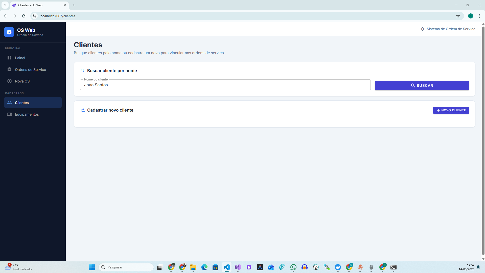

# Fluxo de Teste - Sistema Web OS

## Pre-requisitos
- API rodando em http://localhost:8080 (ou porta configurada)
- Web rodando em http://localhost:5111 (ou porta configurada)
- Banco MySQL com migrations aplicadas

---

## Passo 1 - Cadastrar Cliente

1. Abrir o menu lateral > **Clientes**
2. No campo **"Nome do cliente"**, digitar pelo menos 2 caracteres (ex: "Maria")
3. Clicar em **Buscar**
   - Se o cliente ja existe, clicar em **Selecionar** na linha do grid
   - Se nao existe, seguir para cadastro
4. Clicar em **Novo Cliente**
5. Preencher os campos:
   - Nome: `Maria Silva` (obrigatorio)
   - Documento: `123.456.789-00`
   - Telefone: `(11) 99999-8888`
   - E-mail: `maria@email.com`
   - Endereco: `Rua das Flores, 123`
6. Clicar em **Salvar Cliente**
7. Verificar:
   - Notificacao verde "Cliente cadastrado com sucesso"
   - Badge verde no topo mostrando "Cliente selecionado: Maria Silva"
   - Cliente aparece na lista "Clientes cadastrados nesta sessao"

**Resultado esperado:** ClienteId selecionado e pronto para proximo passo.

---

## Passo 2 - Cadastrar Equipamento (opcional)

1. Abrir o menu lateral > **Equipamentos**
2. No campo **"Nome do cliente"**, digitar o nome do cliente cadastrado (ex: "Maria")
3. Clicar em **Buscar**
4. No grid de clientes, clicar em **Ver Equipamentos** na linha da Maria
5. Verificar: alerta azul mostrando "Exibindo equipamentos de: Maria Silva"
6. Clicar em **Novo Equipamento**
7. Preencher:
   - Tipo: `Notebook` (obrigatorio)
   - Marca: `Dell`
   - Modelo: `Latitude 5540`
   - Numero de Serie: `ABC123XYZ`
8. Clicar em **Salvar Equipamento**
9. Verificar:
   - Notificacao verde "Equipamento cadastrado"
   - Equipamento aparece no grid
10. Clicar em **Selecionar** no equipamento criado
11. Verificar: badge verde no topo "Equipamento selecionado: Notebook - Dell - Latitude 5540"

**Resultado esperado:** EquipamentoId selecionado para vincular na OS.

---

## Passo 3 - Criar Ordem de Servico

1. Abrir o menu lateral > **Nova OS**
2. Na secao **"1. Selecionar Cliente"**:
   - Digitar o nome do cliente no campo de busca (ex: "Maria")
   - Clicar em **Buscar**
   - Clicar em **Selecionar** no cliente desejado
   - Verificar: alerta verde com nome e dados do cliente
3. Na secao **"2. Equipamento"** (aparece apos selecionar cliente):
   - Se o cliente tem equipamentos, eles aparecem automaticamente
   - Clicar em **Selecionar** no equipamento desejado
   - Verificar: alerta azul com dados do equipamento
4. Na secao **"3. Dados da Ordem de Servico"**:
   - Defeito: `Nao liga, sem reacao ao botao power` (obrigatorio)
   - Duracao: `2 horas`
   - Observacoes: `Cliente relatou que o problema comecou apos queda`
5. Clicar em **Criar Ordem de Servico**
6. Verificar:
   - Notificacao verde "OS criada com sucesso"
   - Card verde "OS Criada com Sucesso" com Numero e Status Rascunho
   - Redirecionamento automatico para o detalhe da OS

**Resultado esperado:** OS criada em status Rascunho com numero gerado (ex: OS-20260314-0001).

---

## Passo 4 - Compor Orcamento

Na tela de **Detalhe da OS**:

### 4.1 Adicionar Servico
1. Clicar na aba **Servicos**
2. Preencher: Descricao=`Diagnostico completo`, Qtd=`1`, Valor Unitario=`150.00`
3. Clicar em **Adicionar**
4. Verificar: servico aparece no grid, resumo financeiro atualizado

### 4.2 Adicionar Produto
1. Clicar na aba **Produtos**
2. Preencher: Descricao=`Placa-mae compativel`, Qtd=`1`, Valor Unitario=`450.00`
3. Clicar em **Adicionar**

### 4.3 Adicionar Taxa
1. Clicar na aba **Taxas**
2. Preencher: Descricao=`Taxa de urgencia`, Valor=`30.00`
3. Clicar em **Adicionar**

### 4.4 Aplicar Desconto
1. Clicar na aba **Desconto**
2. Selecionar Tipo=`ValorFixo`, Valor=`50.00`
3. Clicar em **Aplicar Desconto**

### 4.5 Verificar Resumo Financeiro
- Servicos: R$ 150,00
- Produtos: R$ 450,00
- Taxas: R$ 30,00
- Desconto: -R$ 50,00
- **Total Final: R$ 580,00**
- Saldo Restante: R$ 580,00

### 4.6 Adicionar Anotacao
1. Clicar na aba **Anotacoes**
2. Preencher: Texto=`Cliente autorizou reparo por telefone`, Autor=`Joao Tecnico`
3. Clicar em **Adicionar Anotacao**

---

## Passo 5 - Enviar Orcamento

1. Na secao **Acoes de Status**, clicar em **Enviar Orcamento**
2. Verificar:
   - Status muda para **Orcamento** (badge azul)
   - Timeline mostra "Orcamento" como ativo
   - Alerta amarelo: "Edicao de itens bloqueada apos envio para Orcamento"
   - Abas de servicos/produtos/taxas/desconto ficam sem formulario de adicao
   - Botao "Enviar Orcamento" desaparece
   - Botoes "Aprovar" e "Rejeitar" aparecem

---

## Passo 6 - Aprovar e Executar

1. Clicar em **Aprovar** > Status muda para **Aprovada**
2. Clicar em **Iniciar Andamento** > Status muda para **Em Andamento**
3. Clicar em **Concluir** > Status muda para **Concluida**

---

## Passo 7 - Registrar Pagamento

1. Clicar na aba **Pagamentos**
2. Preencher: Meio=`Pix`, Valor=`580.00`, Data=data atual
3. Clicar em **Registrar**
4. Verificar:
   - Pagamento aparece no grid
   - Pago: R$ 580,00
   - Saldo Restante: R$ 0,00

---

## Passo 8 - Entregar

1. Na secao **Acoes de Status**, clicar em **Entregar**
2. Verificar:
   - Status muda para **Entregue** (badge verde)
   - Todos os botoes de acao desaparecem
   - Timeline mostra todos os passos como concluidos

---

## Passo 9 - Verificar na Lista

1. Abrir o menu lateral > **Ordens de Servico**
2. Verificar: OS criada aparece na listagem
3. Testar filtros:
   - Buscar pelo numero (ex: "OS-2026")
   - Filtrar por status "Entregue"
4. Clicar em **Abrir** na OS para voltar ao detalhe

---

## Analise Senior - Pontos de Atencao

### O que esta funcionando bem
- Fluxo de cadastro completo de ponta a ponta (cliente > equipamento > OS > composicao > envio > fechamento)
- MVVM bem implementado: View nao chama HttpClient direto
- Busca por nome em vez de GUID melhora drasticamente a usabilidade
- Bloqueio de edicao apos envio para Orcamento esta correto
- Validacoes client-side + server-side cobrindo campos obrigatorios
- Loading/submitting states em todas as operacoes
- Notificacoes de sucesso/erro consistentes

### Pontos para evolucao futura
1. **Edicao de cliente/equipamento**: a API atual nao expoe PUT para clientes e equipamentos - quando precisar editar, adicionar o endpoint
2. **Exclusao de itens da OS**: nao ha DELETE de servico/produto/taxa individual - so adicao
3. **Busca de OS por nome do cliente**: a listagem de OS filtra por ClienteId (GUID) - considerar adicionar filtro por nome na API
4. **Paginacao na busca de clientes**: hoje retorna ate 20 resultados - para bases maiores, adicionar paginacao
5. **Autocomplete**: a busca por nome poderia ser um autocomplete/typeahead em vez de busca+grid
6. **Validacao de documento (CPF/CNPJ)**: hoje e texto livre - considerar mascara e validacao de digitos
7. **Impressao/PDF**: endpoint existe na API mas nao esta integrado na tela
8. **Concorrencia**: mecanismo de ExpectedUpdatedAt esta no pagamento/status mas nao na edicao geral
