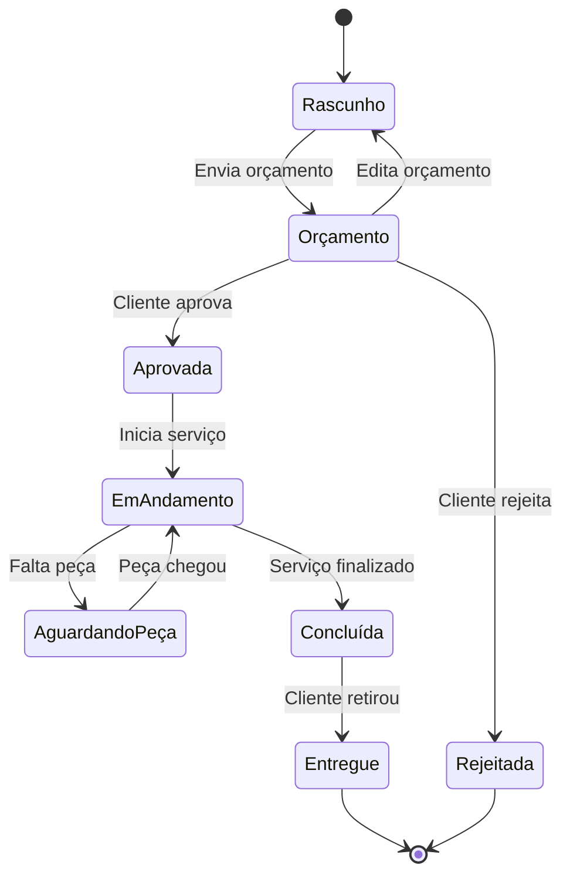

# 📋 Sistema de Ordem de Serviço — Regras de Negócio

> [!NOTE]
> Documento vivo — será refinado conforme discussões antes da implementação.

---

## 1. Visão Geral

O sistema de **Ordem de Serviço (OS)** gerencia todo o ciclo de vida de um atendimento técnico, desde o registro do cliente e do equipamento até a finalização com assinatura e relatório. O modelo da OS é dividido em três blocos principais:

| Bloco | Responsabilidade |
|---|---|
| **Informações Básicas** | Identificação do cliente, equipamento, defeito e prazos |
| **Pedido** | Composição financeira: serviços, produtos, descontos e taxas |
| **Detalhes** | Condições comerciais, garantia, documentação e assinatura |

---

## 2. Informações Básicas

### 2.1 Dados do Cliente

| Campo | Tipo | Obrigatório | Regras |
|---|---|---|---|
| **Cliente** | `referência` | ✅ Sim | Deve referenciar um cliente cadastrado. Se não existir, permitir cadastro rápido inline. |

### 2.2 Datas e Prazos

| Campo | Tipo | Obrigatório | Regras |
|---|---|---|---|
| **Data** | `date` | ✅ Sim | Data de abertura da OS. Preenchida automaticamente com a data atual, editável. |
| **Horário** | `time` | ✅ Sim | Horário de abertura. Preenchido automaticamente com o horário atual, editável. |
| **Validade** | `date` | ❌ Não | Data limite de validade do orçamento. Se preenchida, deve ser ≥ Data de abertura. |
| **Prazo** | `date` ou `int (dias)` | ❌ Não | Prazo estimado para conclusão do serviço. Se preenchido como data, deve ser ≥ Data de abertura. |

> [!IMPORTANT]
> **Validade** e **Prazo** são campos diferentes:
> - **Validade** → até quando o orçamento é válido para o cliente aceitar.
> - **Prazo** → estimativa de quando o serviço será concluído após aprovação.

### 2.3 Dados do Equipamento

| Campo | Tipo | Obrigatório | Regras |
|---|---|---|---|
| **Marca** | `string` | ❌ Não | Marca do equipamento (ex: Samsung, Apple, LG). Sugestão via autocomplete de marcas já cadastradas. |
| **Modelo** | `string` | ❌ Não | Modelo específico (ex: Galaxy S24, iPhone 15 Pro). |
| **Aparelho** | `string` | ❌ Não | Tipo do aparelho (ex: Celular, Notebook, Impressora). Idealmente uma lista pré-definida com opção de texto livre. |
| **Equipamento** | `string` | ❌ Não | Descrição adicional do equipamento, quando necessário diferenciar de "Aparelho". |
| **Número de série** | `string` | ❌ Não | Identificador único do fabricante. Sem validação de formato (varia por fabricante). |

> [!TIP]
> **Marca + Modelo + Aparelho + Número de série** juntos formam a identificação completa do equipamento. Considerar vincular a um cadastro de equipamentos por cliente para reuso em futuras OSs.

### 2.4 Diagnóstico e Observações

| Campo | Tipo | Obrigatório | Regras |
|---|---|---|---|
| **Defeito** | `text` | ✅ Sim | Descrição do problema relatado pelo cliente. Campo de texto livre, sem limite rígido. |
| **Duração** | `string` | ❌ Não | Tempo estimado ou efetivo do serviço (ex: "2 horas", "3 dias úteis"). |
| **Observações** | `text` | ❌ Não | Notas internas ou externas sobre a OS. |
| **Referência** | `string` | ❌ Não | Código ou identificador externo (ex: número de protocolo do cliente, OS anterior relacionada). |

---

## 3. Pedido

O bloco de **Pedido** define a composição financeira da OS.

### 3.1 Serviços

| Campo | Tipo | Obrigatório | Regras |
|---|---|---|---|
| **Serviço** | `referência` | ✅ (min. 1) | Serviço prestado. Referência a um catálogo de serviços cadastrados ou texto livre. |
| **Descrição** | `string` | ❌ Não | Descrição detalhada do serviço quando necessário. |
| **Quantidade** | `int` | ✅ Sim | Padrão: 1. Deve ser ≥ 1. |
| **Valor unitário** | `decimal` | ✅ Sim | Valor por unidade do serviço. Deve ser ≥ 0. |
| **Subtotal** | `decimal` | Calculado | `Quantidade × Valor unitário`. Campo somente leitura. |

> [!NOTE]
> Uma OS pode ter **múltiplos serviços**. A lista de serviços é uma coleção (1:N).

### 3.2 Produtos

| Campo | Tipo | Obrigatório | Regras |
|---|---|---|---|
| **Produto** | `referência` | ❌ Não | Peça ou produto utilizado. Referência ao catálogo de produtos. |
| **Descrição** | `string` | ❌ Não | Descrição do produto. |
| **Quantidade** | `int` | ✅ Sim | Deve ser ≥ 1. |
| **Valor unitário** | `decimal` | ✅ Sim | Deve ser ≥ 0. |
| **Subtotal** | `decimal` | Calculado | `Quantidade × Valor unitário`. |

> [!NOTE]
> Uma OS pode ter **zero ou mais produtos**. Nem toda OS envolve peças/produtos.

### 3.3 Desconto

| Campo | Tipo | Obrigatório | Regras |
|---|---|---|---|
| **Tipo de desconto** | `enum` | ❌ Não | `percentual` ou `valor_fixo`. |
| **Valor do desconto** | `decimal` | ❌ Não | Se percentual: 0–100%. Se valor fixo: deve ser ≤ subtotal geral. |
| **Desconto calculado** | `decimal` | Calculado | Valor efetivo do desconto aplicado. |

> [!WARNING]
> O desconto **nunca** pode resultar em valor total negativo. Validar antes de persistir.

### 3.4 Taxas

| Campo | Tipo | Obrigatório | Regras |
|---|---|---|---|
| **Descrição da taxa** | `string` | ❌ Não | Nome/descrição da taxa (ex: "Taxa de urgência", "Frete"). |
| **Valor da taxa** | `decimal` | ❌ Não | Valor da taxa. Deve ser ≥ 0. |

> [!NOTE]
> Uma OS pode ter **zero ou mais taxas**. Taxas são somadas ao total.

### 3.5 Cálculo do Total

```
Total = Σ(Subtotal Serviços) + Σ(Subtotal Produtos) - Desconto + Σ(Taxas)
```

| Campo | Regra |
|---|---|
| **Subtotal Serviços** | Soma de todos os subtotais de serviços |
| **Subtotal Produtos** | Soma de todos os subtotais de produtos |
| **Desconto** | Valor calculado do desconto |
| **Total Taxas** | Soma de todas as taxas |
| **Total Geral** | Resultado final. Deve ser ≥ 0 |

---

## 4. Detalhes

O bloco de **Detalhes** cobre condições comerciais, documentação e fechamento da OS.

### 4.1 Condições de Pagamento

| Campo | Tipo | Obrigatório | Regras |
|---|---|---|---|
| **Condição** | `string` ou `enum` | ❌ Não | Ex: "À vista", "30/60/90 dias", "Entrada + parcelas". Idealmente configurável. |
| **Número de parcelas** | `int` | ❌ Não | Se parcelado, número de parcelas. Deve ser ≥ 1. |
| **Valor da entrada** | `decimal` | ❌ Não | Valor da entrada, se aplicável. Deve ser ≤ Total Geral. |

### 4.2 Meios de Pagamento

| Campo | Tipo | Obrigatório | Regras |
|---|---|---|---|
| **Meio** | `enum` ou `string` | ❌ Não | Ex: Dinheiro, PIX, Cartão Crédito, Cartão Débito, Boleto, Transferência. Permite múltiplos meios. |
| **Valor por meio** | `decimal` | ❌ Não | Valor pago em cada meio. Soma deve ser = Total Geral (quando OS finalizada). |

> [!IMPORTANT]
> Uma OS pode ter **pagamento dividido** entre múltiplos meios. A soma dos valores deve bater com o Total Geral no momento do fechamento.

### 4.3 Garantia

| Campo | Tipo | Obrigatório | Regras |
|---|---|---|---|
| **Possui garantia** | `bool` | ✅ Sim | Padrão: `true`. |
| **Duração da garantia** | `int` | ❌ Não | Em dias. Ex: 30, 60, 90. Obrigatório se `possui_garantia = true`. |
| **Termos da garantia** | `text` | ❌ Não | Texto descritivo com condições/exclusões da garantia. Pode ter template padrão. |

### 4.4 Cláusulas Contratuais

| Campo | Tipo | Obrigatório | Regras |
|---|---|---|---|
| **Cláusulas** | `text` | ❌ Não | Termos e condições do contrato de serviço. Pode ser carregado de um template padrão configurável, com possibilidade de edição por OS. |

### 4.5 Informações Adicionais

| Campo | Tipo | Obrigatório | Regras |
|---|---|---|---|
| **Informações adicionais** | `text` | ❌ Não | Qualquer informação complementar relevante. Texto livre. |

### 4.6 Anotações

| Campo | Tipo | Obrigatório | Regras |
|---|---|---|---|
| **Anotação** | `text` | ❌ Não | Notas internas da equipe técnica. **Não visíveis ao cliente** na impressão da OS. |
| **Data/hora** | `datetime` | Automático | Registrado automaticamente ao criar anotação. |
| **Autor** | `referência` | Automático | Usuário que criou a anotação. |

> [!TIP]
> Anotações funcionam como um **histórico interno** — cada nova anotação é adicionada como um novo registro, preservando o histórico completo.

### 4.7 Relatório

| Campo | Tipo | Obrigatório | Regras |
|---|---|---|---|
| **Relatório técnico** | `text` | ❌ Não | Laudo técnico descrevendo o diagnóstico, procedimentos realizados e resultado final. Pode ser visível ao cliente. |

### 4.8 Fotos

| Campo | Tipo | Obrigatório | Regras |
|---|---|---|---|
| **Fotos** | `file[]` | ❌ Não | Upload de imagens do equipamento (antes, durante, depois). Formatos aceitos: JPG, PNG, WEBP. Tamanho máximo por foto: 5 MB. |
| **Legenda** | `string` | ❌ Não | Descrição opcional por foto. |

> [!TIP]
> Fotos são evidências importantes para proteção da empresa e do cliente. Recomendável registrar o estado do equipamento na entrada.

### 4.9 Assinatura do Cliente

| Campo | Tipo | Obrigatório | Regras |
|---|---|---|---|
| **Assinatura** | `signature` (imagem) | ❌ Não | Captura digital da assinatura do cliente. Obrigatória para finalização da OS (quando configurado). |
| **Data da assinatura** | `datetime` | Automático | Registrada automaticamente no momento da captura. |
| **Nome do signatário** | `string` | ❌ Não | Nome de quem assinou, caso diferente do cliente. |

---

## 5. Ciclo de Vida da OS (Status)



| Status | Descrição |
|---|---|
| **Rascunho** | OS criada, ainda sendo preenchida. Pode ser editada livremente. |
| **Orçamento** | Enviada ao cliente para aprovação. Campos financeiros travados para edição (exceto por cancelamento do orçamento). |
| **Aprovada** | Cliente concordou com o orçamento. Serviço pode ser iniciado. |
| **Rejeitada** | Cliente não aceitou o orçamento. OS encerrada. |
| **Em Andamento** | Serviço em execução pelo técnico. |
| **Aguardando Peça** | Serviço pausado por falta de peça/produto. |
| **Concluída** | Serviço finalizado. Aguardando retirada/entrega ao cliente. |
| **Entregue** | Equipamento devolvido ao cliente. OS encerrada com sucesso. |

> [!WARNING]
> Transições de status devem ser **unidirecionais** com exceções controladas (ex: voltar de Orçamento para Rascunho). Nunca permitir voltar de Concluída para Em Andamento sem um fluxo de reabertura documentado.

---

## 6. Regras de Negócio Gerais

### 6.1 Numeração

- Cada OS recebe um **número sequencial único** gerado automaticamente.
- Formato sugerido: `OS-YYYYMMDD-XXXX` (ex: `OS-20260307-0001`).
- O número **nunca** é reutilizado, mesmo para OS canceladas.

### 6.2 Permissões

| Ação | Quem pode |
|---|---|
| Criar OS | Atendente, Técnico, Admin |
| Editar OS (Rascunho) | Atendente, Técnico, Admin |
| Enviar orçamento | Atendente, Admin |
| Aprovar/Rejeitar orçamento | Atendente (em nome do cliente), Admin |
| Alterar status para Em Andamento | Técnico, Admin |
| Concluir OS | Técnico, Admin |
| Registrar entrega | Atendente, Admin |
| Cancelar OS | Admin |
| Visualizar OS | Todos os perfis autenticados |

### 6.3 Impressão / PDF

- A OS deve ser exportável em **PDF** para envio ao cliente ou impressão.
- O PDF deve incluir: dados do cliente, equipamento, serviços, produtos, totais, condições de pagamento, garantia, cláusulas e espaço para assinatura.
- **Anotações internas NÃO devem aparecer** no PDF do cliente.

### 6.4 Auditoria

- Toda alteração em campos críticos (status, valores, desconto) deve gerar um registro de auditoria com:
  - Campo alterado
  - Valor anterior → Valor novo
  - Usuário responsável
  - Data/hora da alteração

---

## 7. Pontos para Discussão

> [!IMPORTANT]
> Itens que precisam de decisão antes de iniciar a implementação:

1. **Cadastro de clientes**: já existe um módulo de clientes, ou será criado junto?
2. **Catálogo de serviços e produtos**: serão pré-cadastrados ou permitimos apenas texto livre?
3. **Multi-técnico**: uma OS pode ser atribuída a mais de um técnico?
4. **Notificações**: enviar e-mail/WhatsApp ao cliente quando o status mudar?
5. **Templates de garantia e cláusulas**: teremos templates configuráveis ou texto fixo?
6. **Assinatura digital**: obrigatória para fechar a OS ou opcional?
7. **Fotos**: limite máximo de fotos por OS?
8. **Relatório técnico**: será um campo único ou estruturado (diagnóstico + procedimento + conclusão)?
9. **Histórico do equipamento**: vincular OSs anteriores do mesmo equipamento/cliente?
10. **Integração fiscal**: emitir nota fiscal vinculada à OS?
